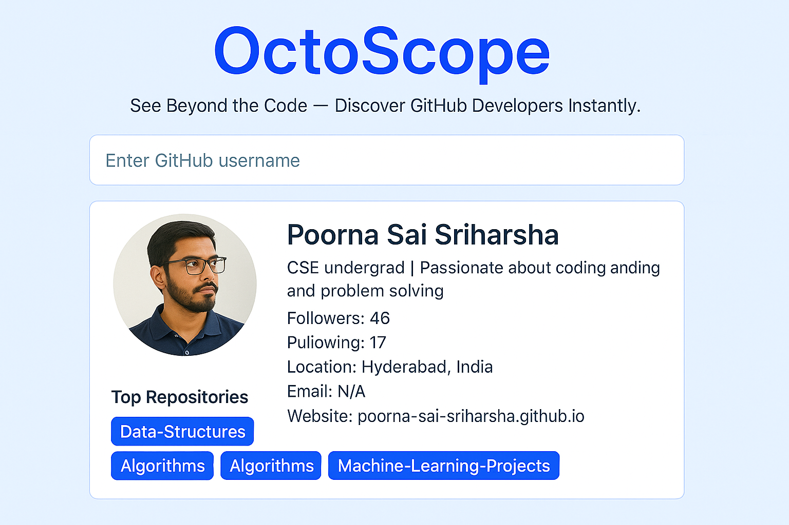

## 🔍 OctoScope
Developed OctoScope, a web application that provides instant GitHub profile and repository searches, featuring real-time, debounced autocomplete for optimized performance. Built with HTML, CSS, and JavaScript, its modern, responsive UI ensures smooth animations. The app utilizes Axios for efficient API communication and robust error handling, enhancing usability with a loading spinner, clickable autocomplete, and direct repository links.

## 🚀 Live Demo
For a live demo:- https://poorna-sai-sriharsha.github.io/OctoScope/

## 📸 Screenshots

## ✨ Features
- ✅ Search GitHub users by username with real-time autocomplete suggestions. 
- 📋 Display user profile details including avatar, bio, followers, following, and public repositories. 
- 🔗 Showcase up to five recent repositories with direct links to GitHub. 
- 🎨 Modern UI with gradient backgrounds and subtle animations. 
- 📱 Fully responsive design for seamless use on mobile and desktop devices.

## 🧠 How It Works
- OctoScope uses the GitHub API to fetch user profiles and repositories based on the entered username. 
- Autocomplete functionality provides real-time suggestions as users type, debounced to optimize API calls. 
- User profile data is displayed in a clean, card-based layout with a fade-in animation. 
- Up to five recent repositories are fetched and displayed as clickable links. 
- Error handling ensures clear feedback for invalid usernames or API issues. 

## 🛠️ Built With
- HTML5
- CSS3 (Gradient Backgrounds, Responsive Design, Animations)
- JavaScript (ES6+)
- Axios (https://axios-http.com/) for API requests
- Font Awesome (https://fontawesome.com/) for icons
- Google Fonts (https://fonts.google.com/) – Poppins, Fira Mono

## 🧰 Getting Started
- To run this project locally:- 
- Clone the repo: git clone https://github.com/Poorna-Sai-Sriharsha/OctoScope.git
- Navigate to the project directory: cd OctoScope
- Open index.html in a browser or use a local server (e.g., npx live-server) for the best experience.
- Note: No additional dependencies are required, as all libraries are included via CDNs.

## 🧪 Testing & Deployment
- Tested for compatibility across Chrome, Firefox, Safari, and Edge.
- Verified responsive design on mobile (iOS, Android) and desktop devices.
- Deployed using GitHub Pages for seamless access and live demo availability.

## 📖 What I Learned
- Mastered integration with the GitHub API for fetching user and repository data.
- Implemented debounced autocomplete for efficient and responsive search suggestions.
- Enhanced skills in CSS animations and gradient-based UI design.
- Overcame challenges in handling API errors and ensuring cross-browser compatibility.

## 🤝 Contributing
- Contributions are welcome! Please fork the repository and submit a pull request with your changes. For major updates, open an issue first to discuss your ideas.
